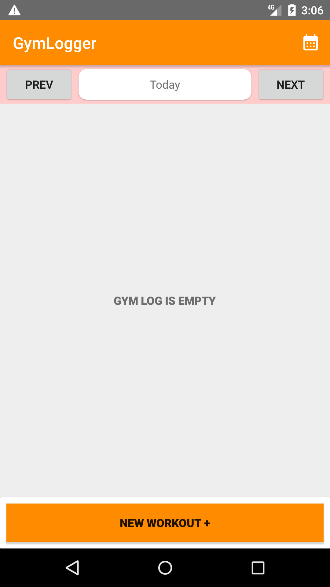

# GymLogger1.0

# About
- "GymLogger" is an android  recording application that logs exercises along with sets and their respective weights and repetitions as it applies.
- Users can record their exercises and have that data stored in a Database.

# Features
- User Databases
- Exercise Details
- Adjustmants of both weights and repetitions
       
# Tools used
- IntelliJ IDEA/ Android Studio
- Android SDK 31.0.0 
- SQLite Database

# Preview
    
 

